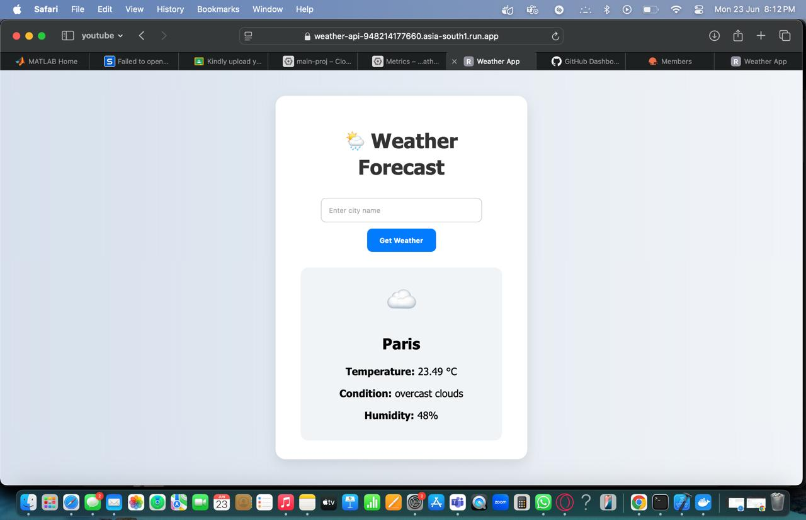

🌤️ Weather API Web App

This is a simple and powerful Flask-based weather application that shows real-time weather data for any city using the OpenWeatherMap API.

Deployed using Google Cloud Platform (GCP) — fully containerized, serverless, and scalable.

🔗 Live Demo

👉 Click here to use the live app

🖼️ UI Preview

☁️ GCP Services Used

This project leverages multiple GCP features to build and deploy a cloud-native application:

GCP Component	Purpose
Cloud Shell	To write and test the project code
Artifact Registry	To store and manage Docker images (my-repo-mumbai)
Cloud Build	To build and containerize the app (gcloud builds submit)
Cloud Run	To deploy the Docker container as a serverless app
IAM Roles	Configured to allow services to push images and deploy to Cloud Run
📦 Tech Stack

Frontend: HTML5, CSS3 (Simple UI using Jinja2 templates)
Backend: Python 3.10, Flask
API: OpenWeatherMap
Container: Docker
Hosting: Google Cloud Run (via Artifact Registry)
🚀 How It Works

User inputs a city name on the website.
Flask backend fetches weather data from OpenWeatherMap.
Weather data is rendered back on the page with temperature, humidity, and description.
UI dynamically updates based on the city entered.
🛠️ Setup & Deployment (GCP)

Build the container:
gcloud builds submit --tag asia-south1-docker.pkg.dev/YOUR_PROJECT_ID/my-repo-mumbai/weather-api
Deploy to Cloud Run: gcloud run deploy weather-api
--image asia-south1-docker.pkg.dev/stoked-sun-462107-k0/my-repo-mumbai/weather-api
--platform managed
--region asia-south1
--allow-unauthenticated
--set-env-vars OPENWEATHER_API_KEY=your_actual_key 📁 Project Structure

weather-api/ ├── app.py ├── Dockerfile ├── requirements.txt ├── weather-ui-preview..jpeg ├── templates/ │ └── index.html ✨ Features

Clean UI to enter any city Real-time weather display (temperature, humidity, sky condition) Automatically defaults to Mumbai if no city entered Handles invalid city errors Responsive and lightweight

